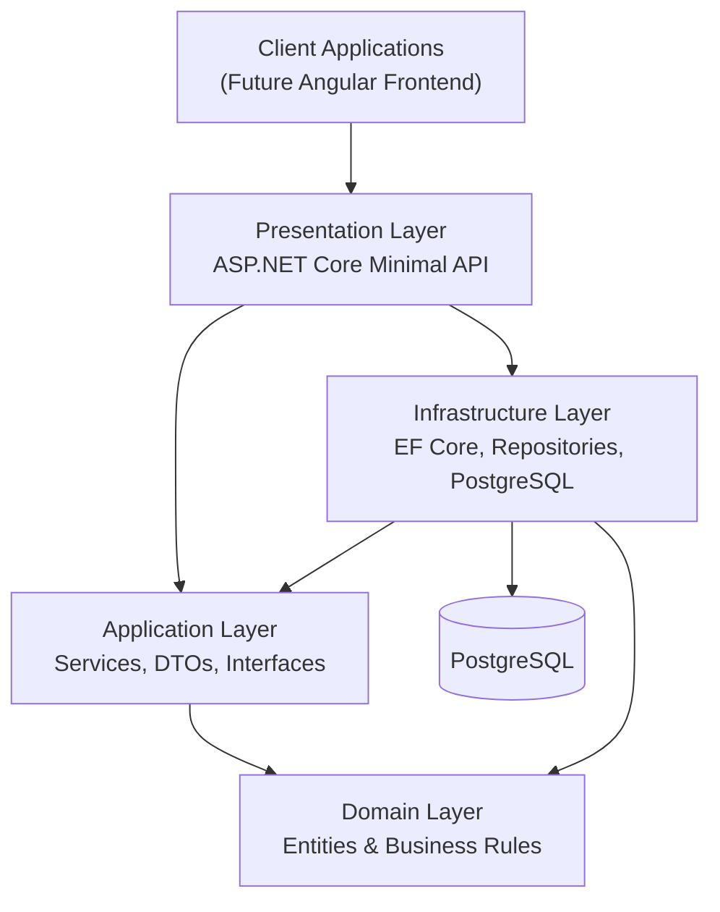

# Personal Finance Management System

> A production-style **Personal Finance Management System** built with **ASP.NET 10, Clean Architecture, PostgreSQL, Docker, JWT Authentication**, and comprehensive automated testing.

---

## Overview

Expense Tracker is a backend-first personal finance management application designed to demonstrate modern software engineering practices rather than simply implementing CRUD operations.

The project emphasizes maintainability, scalability, testability, and clean software architecture while providing a solid foundation for a future Angular frontend and cloud-native deployment.

Although the frontend is still under development, the backend is fully functional and designed to support real-world personal finance scenarios.

---

## Why This Project?

Many portfolio projects demonstrate how to build REST APIs.

This project focuses on demonstrating **how production-quality backend applications are designed**, including:

- Clean Architecture
- Domain-driven design principles
- Authentication & Authorization
- Separation of concerns
- Automated testing
- Continuous Integration
- Dockerized development
- Maintainable codebase

---

## Key Features

### Authentication

- JWT Bearer Authentication
- Secure password hashing
- User registration
- User login
- Protected endpoints

### Category Management

- Create categories
- Update categories
- Delete categories
- User-specific categories

### Transaction Management

- Income transactions
- Expense transactions
- Update transactions
- Delete transactions
- User isolation

### Reporting

- Monthly income summary
- Monthly expense summary
- Monthly balance calculation

### Quality

- Clean Architecture
- FluentValidation
- Global Exception Handling
- RFC7807 Problem Details
- Unit Tests
- Integration Tests
- GitHub Actions
- Code Coverage

---

## Technology Stack

### Backend

- ASP.NET 10
- ASP.NET Core Minimal APIs
- Entity Framework Core
- PostgreSQL
- JWT Authentication
- FluentValidation
- Serilog

### Testing

- xUnit
- FluentAssertions
- Moq
- Testcontainers
- Coverlet

### DevOps

- Docker
- Docker Compose
- GitHub Actions

### Planned Frontend

- Angular
- TypeScript
- Angular Material
- Chart.js

---

## Architecture

The solution follows **Clean Architecture** to separate business logic from infrastructure and presentation concerns.



### Design Principles

- Dependency Inversion
- SOLID Principles
- Repository Pattern
- Unit of Work
- Options Pattern
- Dependency Injection

---

## Repository Structure

```text
expense-tracker/
├── backend/
│   └── README.md
├── frontend/
│   └── README.md
├── docs/
├── .github/
├── README.md
└── docker-compose.yml
```

---

## Current Project Status

### Completed

- ASP.NET Minimal API
- JWT Authentication
- Category Management
- Transaction Management
- Monthly Reports
- PostgreSQL
- Docker
- FluentValidation
- Global Exception Handling
- Unit Tests
- Integration Tests
- GitHub Actions CI
- Code Coverage

### In Progress

- Repository Documentation
- API Screenshots

### Planned

- Angular Frontend
- Dashboard
- Charts
- Budget Planning
- OpenTelemetry
- Prometheus
- Grafana
- Azure Deployment
- Kubernetes
- AI-powered Spending Insights

---

## Architecture Decisions

| Decision  | Reason    |
|-----------|-----------|
| Clean Architecture | Separation of concerns and long-term maintainability|
| Minimal APIs | Lightweight, modern ASP.NET Core development |
| PostgreSQL | Open-source relational database with excellent EF Core support |
| JWT Authentication | Stateless authentication suitable for REST APIs |
| FluentValidation | Keep validation outside endpoint logic |
| Testcontainers | Reliable integration tests using a real PostgreSQL instance |
| GitHub Actions | Continuous Integration and automated quality checks |

---

## Quality Assurance

The project includes multiple layers of automated quality checks.

### Unit Tests

- Authentication Services
- Category Services
- Transaction Services
- Report Services

### Integration Tests

- Authentication Endpoints
- Category Endpoints
- Transaction Endpoints
- Report Endpoints

Integration tests execute against a real PostgreSQL database using Testcontainers.

---

## Documentation

Additional documentation is available inside the project.

| Documentation | Description   |
|---------------|---------------|
| [`backend/README.md`](./backend/README.md) | Backend architecture, setup and API documentation |
| [`frontend/README.md`](./frontend/README.md) | Frontend documentation (planned) |

---

## Screenshots

The following screenshots will be added as the project evolves.

- Scalar API Documentation
- GitHub Actions
- Code Coverage Report
- Angular Dashboard

---

## Development Roadmap

### Phase 1

- Backend REST API
- Authentication
- Categories
- Transactions
- Reports

### Phase 2

- Angular Frontend
- Dashboard
- Charts
- Responsive UI

### Phase 3

- OpenTelemetry
- Prometheus
- Grafana
- Azure Deployment
- Kubernetes

### Phase 4

- AI-powered Spending Insights
- Budget Forecasting
- Receipt Scanning
- Smart Financial Recommendations

---

## About the Author

**Handyana Sumitra Atmaja**

Senior Software Engineer

Core Technologies:

- C#
- .NET
- ASP.NET Core
- Azure
- Docker
- Kubernetes
- PostgreSQL
- Angular
- Clean Architecture

LinkedIn:
https://www.linkedin.com/in/handyana-sumitra-atmaja

GitHub:
https://github.com/handyana05

---

## License

This project is licensed under the MIT License.