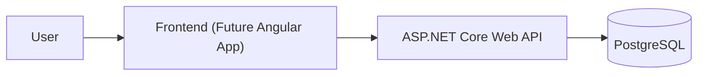

# Expense Tracker

A modern personal finance management application built using ASP.NET Core, PostgreSQL, Docker, and Clean Architecture principles.

The project demonstrates enterprise-grade software engineering practices including domain-driven design, authentication, testing, CI/CD, observability, and cloud-ready deployment.

---

## Project Goals

The purpose of this project is to showcase:

- Clean Architecture
- ASP.NET Core Web API
- Entity Framework Core
- PostgreSQL
- JWT Authentication
- Docker
- GitHub Actions
- Automated Testing
- Cloud-ready deployment patterns

---

## Repository Structure

```text
expense-tracker/
├── backend/
├── frontend/
├── docs/
├── .github/
└── docker-compose.yml
```

---

## Architecture Overview



---

## Current Status

### Implemented

- Backend API
- Authentication
- Categories
- Transactions
- Monthly Reports
- Unit Tests
- Docker Support

### Planned

- Angular Frontend
- OpenTelemetry
- Prometheus
- Grafana Dashboard
- Azure Deployment
- Budget Planning
- Notifications

---

## Backend

The backend follows Clean Architecture and contains all business logic and API endpoints.

See:

[Expenses Tracker API](./expenses-tracker-api/README.md)

```text
backend/README.md
```

for detailed documentation.

---

## Frontend

The frontend application will be added in a future release.

Planned stack:

- Angular
- TypeScript
- Angular Material
- JWT Authentication
- Dashboard & Reporting

---

## Development Roadmap

### Phase 1

- REST API
- Authentication
- Categories
- Transactions
- Reports

### Phase 2

- Angular Frontend
- Charts & Dashboard
- User Settings

### Phase 3

- OpenTelemetry
- Prometheus
- Grafana
- Kubernetes Deployment

### Phase 4

- AI-powered spending insights
- Receipt scanning
- Budget forecasting

---

## Technologies

### Backend

- ASP.NET Core
- Entity Framework Core
- PostgreSQL
- FluentValidation
- Serilog

### DevOps

- Docker
- GitHub Actions

### Planned

- Angular
- OpenTelemetry
- Prometheus
- Grafana
- Kubernetes

---

## Screenshots

Screenshots will be added as the project evolves.

---

## Author

**Handyana Sumitra Atmaja**

Senior Software Engineer

Technologies:

C# • .NET • Azure • Docker • Kubernetes • PostgreSQL • Angular • Clean Architecture

LinkedIn:
https://www.linkedin.com/in/handyana-sumitra-atmaja

GitHub:
https://github.com/handyana05