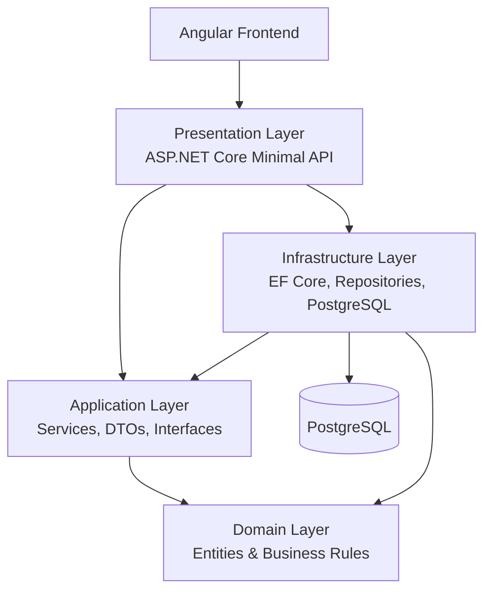

# Personal Finance Management System

> A production-style **Personal Finance Management System** built with **ASP.NET 10, Angular 22, PostgreSQL, Docker, JWT Authentication**, and comprehensive automated testing.

---

## Overview

Expense Tracker is a full-stack personal finance management application designed to demonstrate modern software engineering practices rather than simply implementing CRUD operations.

The project emphasizes maintainability, scalability, testability, and clean software architecture while providing a solid foundation for a future Angular frontend and cloud-native deployment.

The application includes a tested backend API and an Angular frontend with authentication, a public landing page, responsive navigation, finance management, dashboard summaries, and monthly reports.

---

## Why This Project?

Many portfolio projects demonstrate how to build REST APIs.

This project focuses on demonstrating **how production-quality backend applications are designed**, including:

- Clean Architecture
- Domain-driven design principles
- Authentication & Authorization
- Separation of concerns
- Automated testing
- Continuous Integration
- Dockerized development
- Maintainable codebase

---

## Key Features

### Authentication

- JWT Bearer Authentication
- Secure password hashing
- User registration
- User login
- Protected endpoints

### Category Management

- Create categories
- Update categories
- Delete categories
- User-specific categories

### Transaction Management

- Income transactions
- Expense transactions
- Update transactions
- Delete transactions
- User isolation

### Reporting

- Monthly income summary
- Monthly expense summary
- Monthly balance calculation

### Angular Frontend

- Public landing page
- Login and registration
- Responsive authenticated shell
- Category and transaction management
- Dashboard summary and recent transactions
- Monthly reports
- Automatic redirect when an authenticated session expires
- Angular Material UI and Vitest coverage

### Quality

- Clean Architecture
- FluentValidation
- Global Exception Handling
- RFC7807 Problem Details
- Unit Tests
- Integration Tests
- GitHub Actions
- Code Coverage

---

## Technology Stack

### Backend

- ASP.NET 10
- ASP.NET Core Minimal APIs
- Entity Framework Core
- PostgreSQL
- JWT Authentication
- FluentValidation
- Serilog

### Testing

- xUnit
- FluentAssertions
- Moq
- Testcontainers
- Coverlet

### DevOps

- Docker
- Docker Compose
- GitHub Actions

### Frontend

- Angular 22
- TypeScript
- Angular Material
- Signals and `httpResource`
- Vitest
- Chart.js

---

## Architecture

The solution follows **Clean Architecture** to separate business logic from infrastructure and presentation concerns.


```mermaid
flowchart TD

    Client["Angular Frontend"]

    API["Presentation Layer<br/>ASP.NET Core Minimal API"]

    APP["Application Layer<br/>Services, DTOs, Interfaces"]

    DOMAIN["Domain Layer<br/>Entities & Business Rules"]

    INFRA["Infrastructure Layer<br/>EF Core, Repositories, PostgreSQL"]

    DB[(PostgreSQL)]

    Client --> API
    API --> APP
    API --> INFRA
    APP --> DOMAIN
    INFRA --> APP
    INFRA --> DOMAIN
    INFRA --> DB
```

### Design Principles

- Dependency Inversion
- SOLID Principles
- Repository Pattern
- Unit of Work
- Options Pattern
- Dependency Injection

---

## Repository Structure

```text
expense-tracker/
├── backend/
│   └── README.md
├── frontend/
│   └── README.md
├── docs/
├── .github/
├── README.md
└── docker-compose.yml
```

---

## Current Project Status

### Completed

- ASP.NET Minimal API
- JWT Authentication
- Category Management
- Transaction Management
- Monthly Reports
- PostgreSQL
- Docker
- FluentValidation
- Global Exception Handling
- Unit Tests
- Integration Tests
- GitHub Actions CI
- Code Coverage
- Angular landing page
- Angular authentication and protected routes
- Responsive application shell and active navigation
- Categories and Transactions UI
- Dashboard and Monthly Reports UI
- Income-versus-expenses report visualization
- Responsive, categorized recent-transaction presentation
- Transaction CSV import and export
- Production multi-stage Docker images and full-stack Compose orchestration
- Shared Material presentation components
- Frontend unit tests

### In Progress

- Repository Documentation
- Frontend mobile-layout verification
- Cloud deployment workflow

### Planned

- Production deployment
- Budget Planning
- OpenTelemetry
- Prometheus
- Grafana
- Azure Deployment
- Kubernetes
- AI-powered Spending Insights

---

## Architecture Decisions

| Decision  | Reason    |
|-----------|-----------|
| Clean Architecture | Separation of concerns and long-term maintainability|
| Minimal APIs | Lightweight, modern ASP.NET Core development |
| PostgreSQL | Open-source relational database with excellent EF Core support |
| JWT Authentication | Stateless authentication suitable for REST APIs |
| FluentValidation | Keep validation outside endpoint logic |
| Testcontainers | Reliable integration tests using a real PostgreSQL instance |
| GitHub Actions | Continuous Integration and automated quality checks |

---

## Quality Assurance

The project includes multiple layers of automated quality checks.

### Unit Tests

- Authentication Services
- Category Services
- Transaction Services
- Report Services

### Integration Tests

- Authentication Endpoints
- Category Endpoints
- Transaction Endpoints
- Report Endpoints

Integration tests execute against a real PostgreSQL database using Testcontainers.

---

## Documentation

Additional documentation is available inside the project.

| Documentation | Description   |
|---------------|---------------|
| [`backend/README.md`](./backend/README.md) | Backend architecture, setup and API documentation |
| [`frontend/README.md`](./frontend/README.md) | Frontend architecture, setup, routes, testing, CSV, and container documentation |
| [`docs/adr`](./docs/adr) | Accepted architectural decisions and their trade-offs |

---

## Full-Stack Docker

The production-oriented Compose stack runs PostgreSQL, the ASP.NET Core API, and
the Angular application behind Nginx. Nginx serves the SPA and proxies `/api` to
the backend, so the browser uses one origin.

Create local configuration from the example and replace every placeholder:

```bash
cp .env.example .env
```

Start the complete stack:

```bash
docker compose up --build -d
```

Open `http://localhost:8080` or the port configured by `FRONTEND_PORT`.

```bash
docker compose ps
docker compose logs -f backend frontend
docker compose down
```

The PostgreSQL volume survives `docker compose down`. The backend waits for the
database health check and applies EF Core migrations at startup only when enabled
by the Compose configuration. Public internet deployment still requires TLS at a
trusted reverse proxy or cloud ingress and production secret management.

---

# Screenshots

## Scalar UI


## Frontend


## GitHub Actions


## Code Coverage


---

## Development Roadmap

### Phase 1

- Backend REST API
- Authentication
- Categories
- Transactions
- Reports

### Phase 2 — Current

- Angular Frontend
- Dashboard
- Responsive UI
- Frontend automated tests
- Public landing page

### Phase 2.1 — Next

- Complete mobile-layout verification
- CSV import and export

### Phase 3

- OpenTelemetry
- Prometheus
- Grafana
- Azure Deployment
- Kubernetes

### Phase 4

- AI-powered Spending Insights
- Budget Forecasting
- Receipt Scanning
- Smart Financial Recommendations

---

## About the Author

**Handyana Sumitra Atmaja**

Senior Software Engineer

Core Technologies:

- C#
- .NET
- ASP.NET Core
- Azure
- Docker
- Kubernetes
- PostgreSQL
- Angular
- Clean Architecture

LinkedIn:
https://www.linkedin.com/in/handyana-sumitra-atmaja

GitHub:
https://github.com/handyana05

---

## License

This project is licensed under the MIT License.
