# Personal Finance Management System

> A production-style **Personal Finance Management System** built with **ASP.NET 10, Angular 22, PostgreSQL, Docker, JWT Authentication**, and comprehensive automated testing.

---

## Overview

Expense Tracker is a full-stack personal finance management application designed to demonstrate modern software engineering practices rather than simply implementing CRUD operations.

The project emphasizes maintainability, scalability, testability, and clean software architecture while providing a solid foundation for a future Angular frontend and cloud-native deployment.

The application includes a tested backend API and an Angular frontend with authentication, a public landing page, responsive navigation, finance management, dashboard summaries, and monthly reports.

---

## Why This Project?

Many portfolio projects demonstrate how to build REST APIs.

This project focuses on demonstrating **how production-quality backend applications are designed**, including:

- Clean Architecture
- Domain-driven design principles
- Authentication & Authorization
- Separation of concerns
- Automated testing
- Continuous Integration
- Dockerized development
- Maintainable codebase

---

## Key Features

### Authentication

- JWT Bearer Authentication
- Secure password hashing
- User registration
- User login
- Protected endpoints

### Category Management

- Create categories
- Update categories
- Delete categories
- User-specific categories

### Transaction Management

- Income transactions
- Expense transactions
- Update transactions
- Delete transactions
- User isolation

### Reporting

- Monthly income summary
- Monthly expense summary
- Monthly balance calculation

### Angular Frontend

- Public landing page
- Login and registration
- Responsive authenticated shell
- Category and transaction management
- Dashboard summary and recent transactions
- Monthly reports
- Automatic redirect when an authenticated session expires
- Angular Material UI and Vitest coverage
- Persistent light and dark themes
- Runtime English and German localization across the frontend

### Quality

- Clean Architecture
- FluentValidation
- Global Exception Handling
- RFC7807 Problem Details
- Unit Tests
- Integration Tests
- GitHub Actions
- Code Coverage

---

## Technology Stack

### Backend

- ASP.NET 10
- ASP.NET Core Minimal APIs
- Entity Framework Core
- PostgreSQL
- JWT Authentication
- FluentValidation
- Serilog

### Testing

- xUnit
- FluentAssertions
- Moq
- Testcontainers
- Coverlet

### DevOps

- Docker
- Docker Compose
- GitHub Actions

### Frontend

- Angular 22
- TypeScript
- Angular Material
- Signals and `httpResource`
- Vitest
- Chart.js

---

## Architecture

The browser-facing application is served through Nginx, which hosts Angular and
proxies same-origin `/api` requests to the ASP.NET Core backend. The backend
follows Clean Architecture to separate business logic from infrastructure and
presentation concerns.

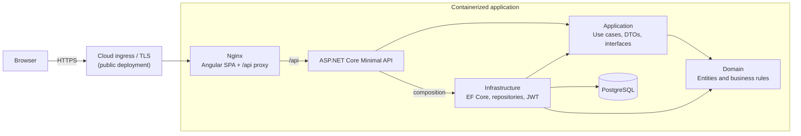
```mermaid
flowchart LR
    Browser["Browser"]
    Ingress["Cloud ingress / TLS<br/>(public deployment)"]

    subgraph Containers["Containerized application"]
        Nginx["Nginx<br/>Angular SPA + /api proxy"]
        API["ASP.NET Core Minimal API"]
        APP["Application<br/>Use cases, DTOs, interfaces"]
        DOMAIN["Domain<br/>Entities and business rules"]
        INFRA["Infrastructure<br/>EF Core, repositories, JWT"]
        DB[(PostgreSQL)]

        Nginx -->|"/api"| API
        API --> APP
        API -->|"composition"| INFRA
        APP --> DOMAIN
        INFRA --> APP
        INFRA --> DOMAIN
        INFRA --> DB
    end

    Browser -->|"HTTPS"| Ingress
    Ingress --> Nginx
```

### Design Principles

- Dependency Inversion
- SOLID Principles
- Repository Pattern
- Unit of Work
- Options Pattern
- Dependency Injection

---

## Repository Structure

```text
expense-tracker/
├── backend/
│   └── README.md
├── frontend/
│   └── README.md
├── docs/
├── .github/
├── README.md
└── docker-compose.yml
```

---

## Current Project Status

### Completed

- ASP.NET Minimal API
- JWT Authentication
- Category Management
- Transaction Management
- Monthly Reports
- PostgreSQL
- Docker
- FluentValidation
- Global Exception Handling
- Unit Tests
- Integration Tests
- GitHub Actions CI
- Code Coverage
- Angular landing page
- Angular authentication and protected routes
- Responsive application shell and active navigation
- Categories and Transactions UI
- Dashboard and Monthly Reports UI
- Income-versus-expenses report visualization
- Responsive, categorized recent-transaction presentation
- Transaction CSV import and export
- Production multi-stage Docker images and full-stack Compose orchestration
- Shared Material presentation components
- Frontend unit tests
- Light/dark appearance and English/German language preferences

### In Progress

- Repository Documentation
- Frontend mobile-layout verification
- Cloud deployment workflow

### Planned

- Production deployment
- Budget Planning
- OpenTelemetry
- Prometheus
- Grafana
- Azure Deployment
- Kubernetes
- AI-powered Spending Insights

---

## Architecture Decisions

| Decision  | Reason    |
|-----------|-----------|
| Clean Architecture | Separation of concerns and long-term maintainability|
| Minimal APIs | Lightweight, modern ASP.NET Core development |
| PostgreSQL | Open-source relational database with excellent EF Core support |
| JWT Authentication | Stateless authentication suitable for REST APIs |
| FluentValidation | Keep validation outside endpoint logic |
| Testcontainers | Reliable integration tests using a real PostgreSQL instance |
| GitHub Actions | Continuous Integration and automated quality checks |

---

## Quality Assurance

The project includes multiple layers of automated quality checks.

### Unit Tests

- Authentication Services
- Category Services
- Transaction Services
- Report Services

### Integration Tests

- Authentication Endpoints
- Category Endpoints
- Transaction Endpoints
- Report Endpoints

Integration tests execute against a real PostgreSQL database using Testcontainers.

### Continuous Integration

GitHub Actions validates every push and pull request targeting `main`. Backend CI
builds the .NET solution, runs the automated tests, generates coverage, and
publishes the coverage report. Frontend CI installs locked dependencies, runs the
complete Vitest suite, and creates an Angular production build.

---

## Documentation

Additional documentation is available inside the project.

| Documentation | Description   |
|---------------|---------------|
| [`backend/README.md`](./backend/README.md) | Backend architecture, setup and API documentation |
| [`frontend/README.md`](./frontend/README.md) | Frontend architecture, setup, routes, testing, CSV, and container documentation |
| [`docs/adr`](./docs/adr) | Accepted architectural decisions and their trade-offs |

---

## Production Deployment Workflow

This project is designed to run as a Docker Compose stack for local development and
for production-like deployment on a single host or managed infrastructure.

### Required environment variables

Create a local `.env` file from `.env.example` and replace every placeholder:

```bash
cp .env.example .env
```

On Windows PowerShell:

```powershell
Copy-Item .env.example .env
```

Required values:

| Variable | Purpose | Local default/example |
|---|---|---|
| `POSTGRES_DB` | PostgreSQL database name | `ExpenseTrackerDb` |
| `POSTGRES_USER` | PostgreSQL user | `postgres` |
| `POSTGRES_PASSWORD` | PostgreSQL password | Replace with a secure value |
| `POSTGRES_PORT` | PostgreSQL port published to the host | `5430` |
| `JWT_SECRET_KEY` | JWT signing key, at least 32 characters | Replace with a random secret |
| `FRONTEND_PORT` | Browser-facing Nginx port | `8080` |

The `.env` file contains secrets, is ignored by Git, and must never be committed.

### Start the stack

```bash
docker compose up --build -d
```

### Validate health

```bash
docker compose ps
Invoke-WebRequest http://localhost:8080/health
```

The frontend health endpoint should return `200 OK` and the body `healthy`.

### Verify the application

Open `http://localhost:8080` or the port configured by `FRONTEND_PORT` and confirm:

- login or registration works
- the dashboard loads
- creating a category and transaction succeeds
- reports render without errors

### Using deploy.sh (simple deploy helper)

This repository includes a small deploy helper script, `deploy.sh`, which simplifies deploying the Compose stack either by building locally or by pointing Compose to pre-built registry images.

Quick usage:

- Build locally and start the stack (useful on a development laptop):

```bash
./deploy.sh
```

- Deploy specific registry images (recommended for CI-driven or immutable deployments):

```bash
./deploy.sh <registry>/expenses-tracker-backend:<tag> <registry>/expenses-tracker-frontend:<tag>
```

- Or via environment variables:

```bash
BACKEND_IMAGE=<registry>/expenses-tracker-backend:<tag> FRONTEND_IMAGE=<registry>/expenses-tracker-frontend:<tag> ./deploy.sh
```

What the script does:

- If image names are provided, it creates a temporary Compose override that references those images, pulls them, and starts the stack with `docker compose -f docker-compose.yml -f <override> up -d`.
- If no images are provided, it runs `docker compose up -d --build` to build from local sources.

Notes:

- Make the script executable before using it: `chmod +x deploy.sh`.
- Keep a secure `.env` file in the deploy target; do not commit secrets.
- The script is intentionally simple — CI systems (GitHub Actions) can SSH to the target and call this script with the image tags produced by the build pipeline.

### Self-hosted deployment (laptop or VM)

Use this approach for quick, low-cost deployments where you control the host. For multi-service deployments the recommended flow is "Compose with registry images" (Method B): build images in CI, push to a registry, and pull them on the target with a Compose override.

Quick steps:

1. Ensure Docker and Docker Compose are installed on the target (laptop or VM).
2. Create a local `.env` from `.env.example` and set secure values (POSTGRES_PASSWORD, JWT_SECRET_KEY).
3. Place the provided `deploy.sh` in the repository root on the target and make it executable (`chmod +x deploy.sh`).
4. Deploy the tested images pushed by CI:

```bash
./deploy.sh <registry>/expenses-tracker-backend:<tag> <registry>/expenses-tracker-frontend:<tag>
```

5. Verify health:

```bash
docker compose ps
curl -fsS http://localhost:8080/health
```

Docs and automation:

- Full self-hosted runbook: [`docs/development/self-hosted-vm-deployment.md`](./docs/development/self-hosted-vm-deployment.md)
- GitHub Actions workflow that can optionally SSH to your host and run `deploy.sh`: `.github/workflows/self-hosted-deploy.yml`

Security notes:

- If you expose your laptop to external SSH for CI-driven deploys, use a dedicated deploy user, restrict the SSH key, and only enable this flow when needed. A safer option is to register a GitHub self-hosted runner on the machine so Actions jobs run locally without SSH.

### Cloud deployment (Azure example)

For production-grade hosting and managed services, use the cloud deployment path. The repository includes an example CI workflow and an Azure guidance document to help get started.

Quick steps (summary):

1. Configure an image registry (ACR or Docker Hub).
2. Use the provided GitHub Actions workflow to build images and push to the registry: `.github/workflows/ci-cd.yml`.
3. Provision managed infrastructure: App Service / Container Apps, Azure Database for PostgreSQL, and Key Vault (or equivalent services on other clouds).
4. Configure the runtime to read secrets from Key Vault / environment variables and point the apps to the registry images.
5. Deploy and validate health and smoke tests.

Docs and automation:

- Azure deployment example and guidance: [`docs/development/azure-deployment-example.md`](./docs/development/azure-deployment-example.md)
- CI/CD workflow for ACR + App Service: `.github/workflows/ci-cd.yml`

Security notes:

- Use managed databases in production and Key Vault (or your cloud secret manager) for secrets.
- Use TLS at the cloud ingress/front door and private networking for DB access.


### Production notes

Public internet deployment still requires:

- TLS termination at a reverse proxy or ingress
- secure secret management
- firewall and port configuration appropriate for the host environment
- backups for the PostgreSQL volume

Do not expose the raw ASP.NET or PostgreSQL ports directly without a trusted network boundary.

## Full-Stack Docker

The production-oriented Compose stack runs PostgreSQL, the ASP.NET Core API, and
the Angular application behind Nginx. Nginx serves the SPA and proxies `/api` to
the backend, so the browser uses one origin.

Create local configuration from the example and replace every placeholder:

```bash
cp .env.example .env
```

On Windows PowerShell:

```powershell
Copy-Item .env.example .env
```

Required configuration:

| Variable | Purpose | Local default/example |
|---|---|---|
| `POSTGRES_DB` | PostgreSQL database name | `ExpenseTrackerDb` |
| `POSTGRES_USER` | PostgreSQL user | `postgres` |
| `POSTGRES_PASSWORD` | PostgreSQL password | Replace with a secure value |
| `POSTGRES_PORT` | PostgreSQL port published to the host | `5430` |
| `JWT_SECRET_KEY` | JWT signing key, at least 32 characters | Replace with a random secret |
| `FRONTEND_PORT` | Browser-facing Nginx port | `8080` |

The `.env` file contains secrets, is ignored by Git, and must never be committed.

Start the complete stack:

```bash
docker compose up --build -d
```

Open `http://localhost:8080` or the port configured by `FRONTEND_PORT`.

Check that all services become healthy:

```bash
docker compose ps
```

Follow application or database logs:

```bash
docker compose logs -f backend frontend
docker compose logs -f postgres
```

Rebuild after source or dependency changes:

```bash
docker compose up --build -d
```

Stop the stack while preserving PostgreSQL data:

```bash
docker compose down
```

The PostgreSQL volume survives `docker compose down`. The backend waits for the
database health check and applies EF Core migrations at startup only when enabled
by the Compose configuration.

To completely reset the local database:

```bash
docker compose down -v
```

> **Warning:** `docker compose down -v` permanently deletes the PostgreSQL volume
> and all locally stored application data.

If startup reports that a port is already allocated, stop the local process or
container using port `8080` or `5430`, or change `FRONTEND_PORT` or
`POSTGRES_PORT` in `.env`.

Public internet deployment still requires TLS at a trusted reverse proxy or cloud
ingress and managed production secrets.

---

# Screenshots

## Scalar UI

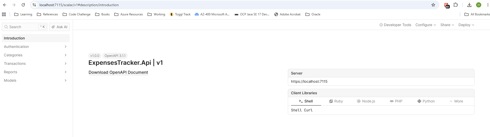
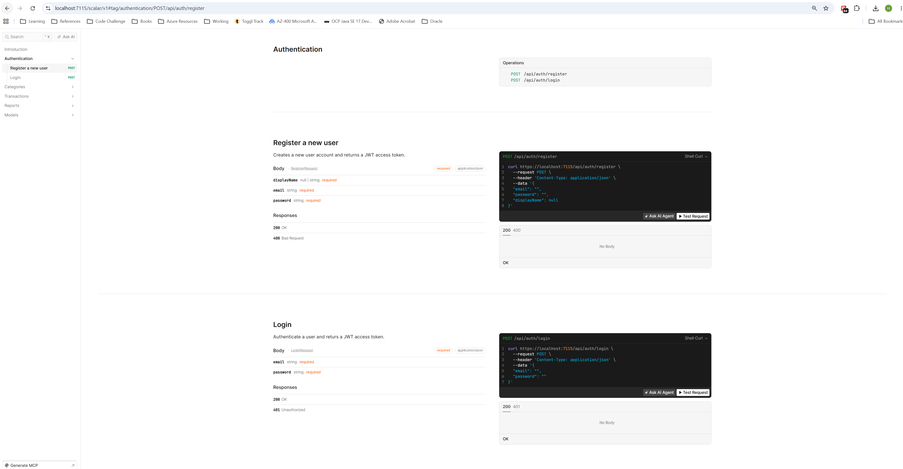
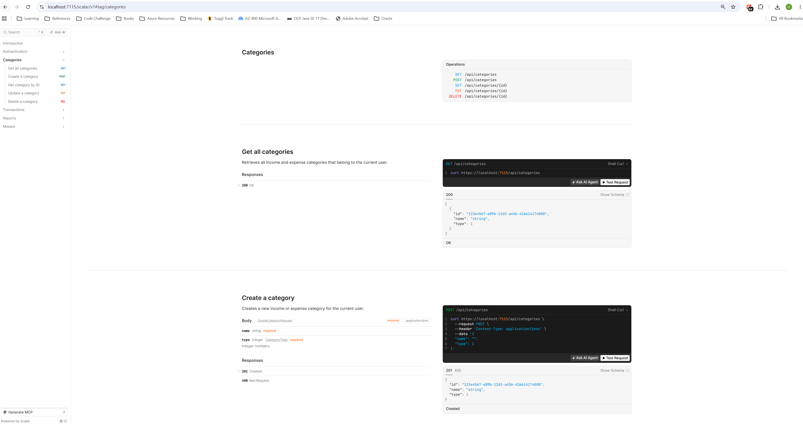
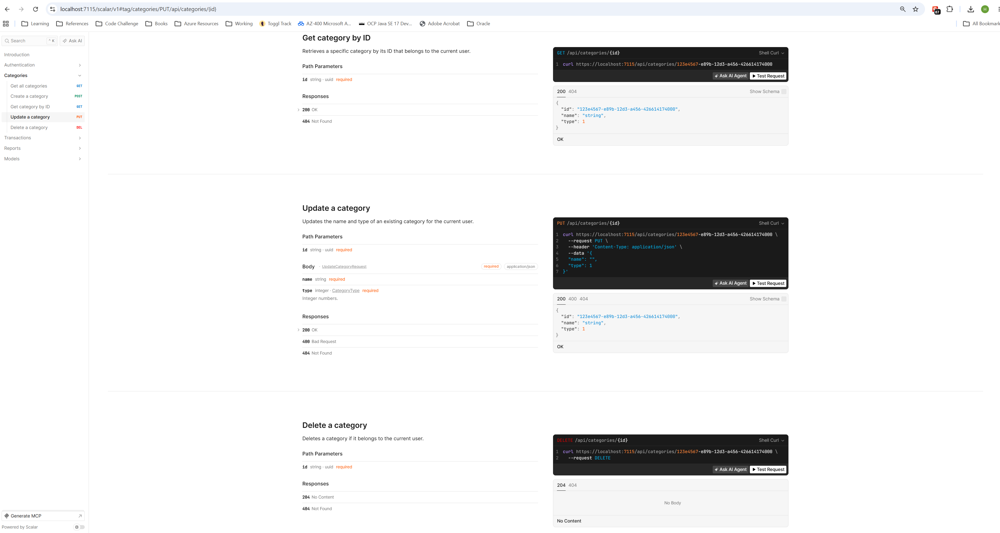

## Frontend

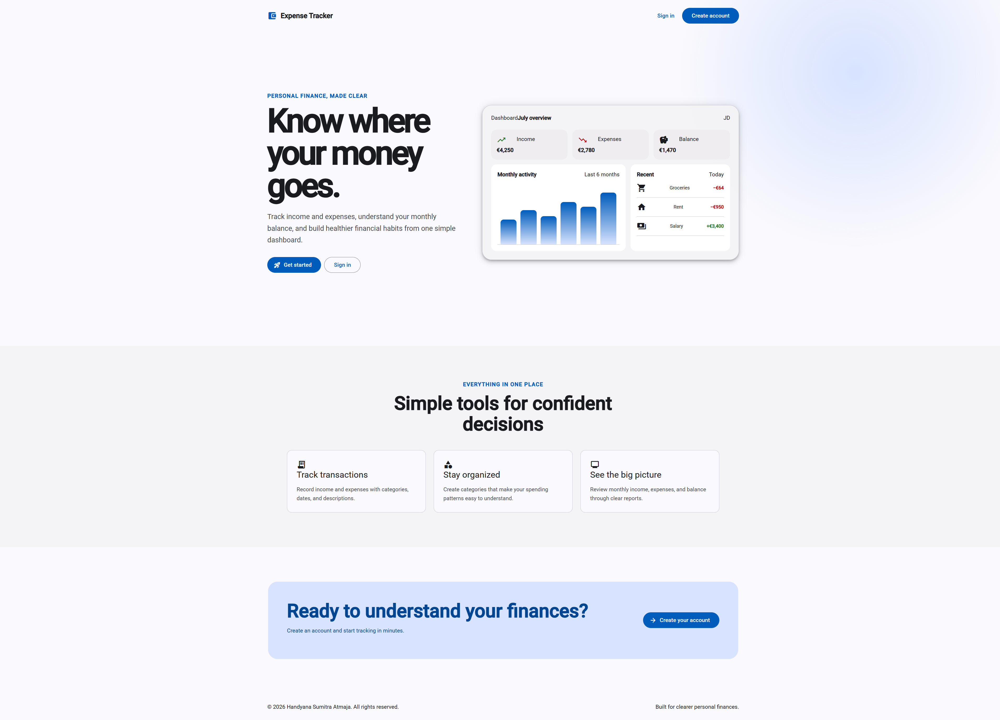
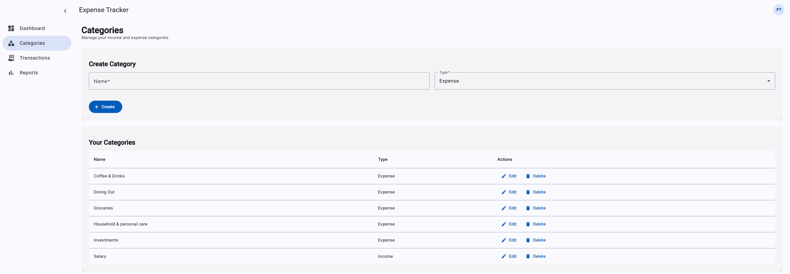
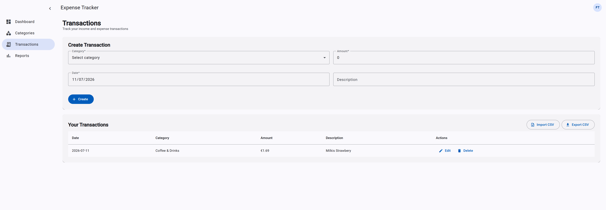
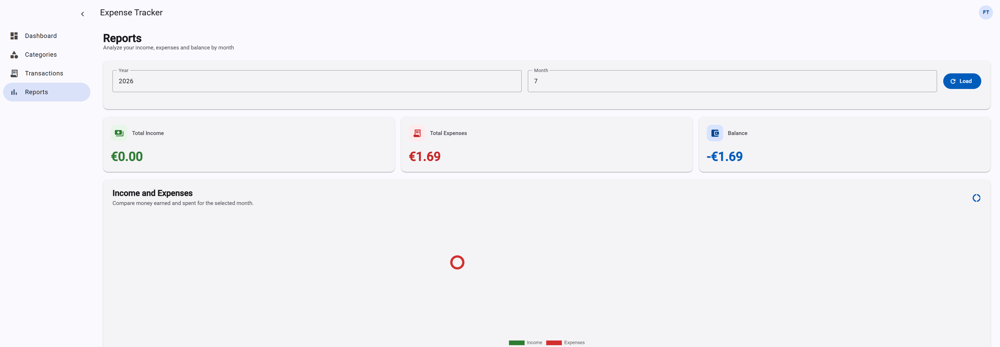
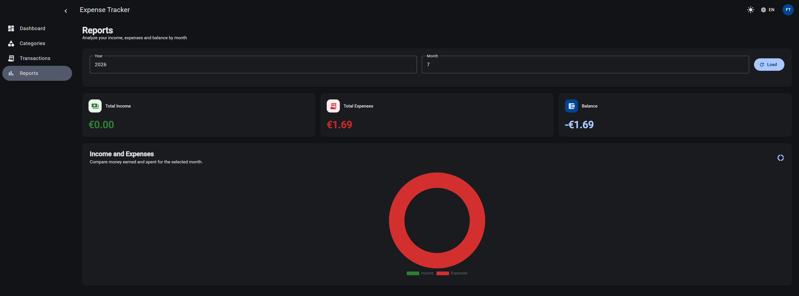

## GitHub Actions

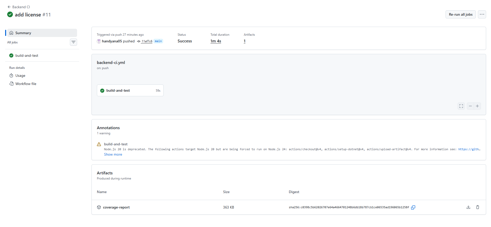
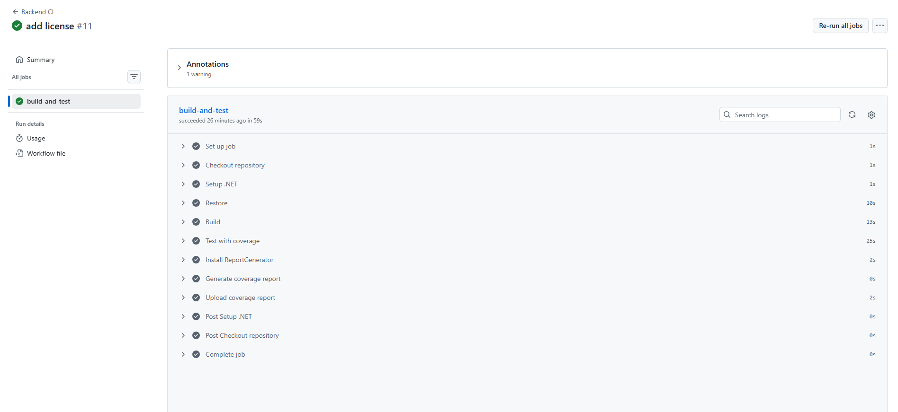

## Code Coverage
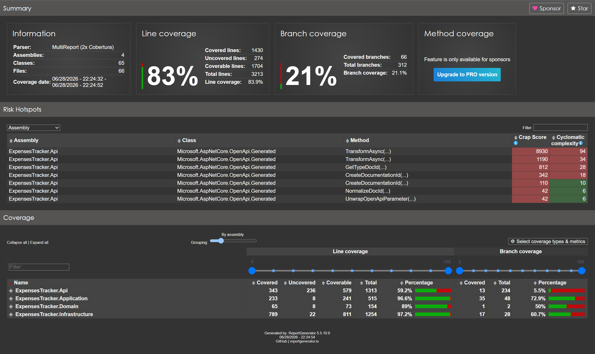

---

## Development Roadmap

### Phase 1 — Complete: Backend Foundation

- Backend REST API
- Authentication
- Categories
- Transactions
- Reports
- Automated unit and integration tests
- PostgreSQL persistence and migrations

### Phase 2 — Complete: Frontend MVP

- Angular Frontend
- Public landing page and authentication flows
- Responsive shell and active navigation
- Categories and Transactions CRUD
- Dashboard and monthly reports
- Reports visualization
- CSV import and export
- Frontend automated tests
- Production multi-stage Docker images
- Full-stack Docker Compose orchestration

### Phase 3 — Current: Deployment Readiness

- Deployment runbooks and documentation added (self-hosted VM, cloud/Azure, and production checklist).
- CI/CD workflows and helper artifacts added: GitHub Actions workflows for ACR/App Service and self-hosted deploy, `deploy.sh`, and `docker-compose.deploy.yml`. (Some workflow files may still be uncommitted in the working tree.)
- Docker Compose healthchecks hardened and local full-stack Compose validated (frontend, backend, PostgreSQL). Frontend health endpoint behavior improved.
- Frontend and backend test/build baseline re-established. Note: Vitest/browser runner requires a browser runtime in some environments; backend integration tests ran under Docker.
- Small UI polish and bug fixes applied (sidenav collapsed/expanded clipping fix).

Remaining work / next actions:

- Decide production database strategy (managed cloud DB vs. host-managed Postgres) and finalize domain name(s).
- Add required GitHub repository secrets and run CI builds to verify image builds and registry pushes (no deploy).
- Provision target infrastructure (Azure resources or prepare target VM) and decide whether to use an SSH-driven CI deploy or a GitHub self-hosted runner.
- Configure TLS, secret management (Key Vault or equivalent), backups, and post-deploy smoke tests/health checks.
- Validate rollback and disaster recovery procedures in a staging run.

### Phase 4 — Observability

- OpenTelemetry
- Structured production logging
- Prometheus
- Grafana
- Alerts and operational dashboards

### Phase 5 — Future Product Enhancements

- AI-powered Spending Insights
- Budgets and forecasting
- Recurring transactions
- Notifications
- Receipt Scanning

---

## About the Author

**Handyana Sumitra Atmaja**

Senior Software Engineer

Core Technologies:

- C#
- .NET
- ASP.NET Core
- Azure
- Docker
- Kubernetes
- PostgreSQL
- Angular
- Clean Architecture

LinkedIn:
https://www.linkedin.com/in/handyana-sumitra-atmaja

GitHub:
https://github.com/handyana05

---

## License

This project is licensed under the MIT License.
