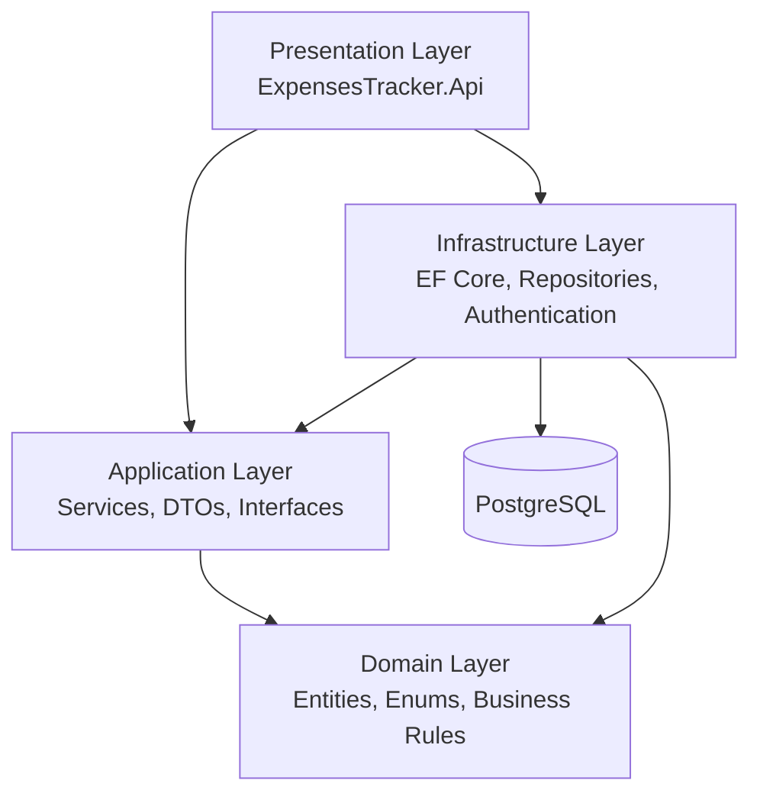
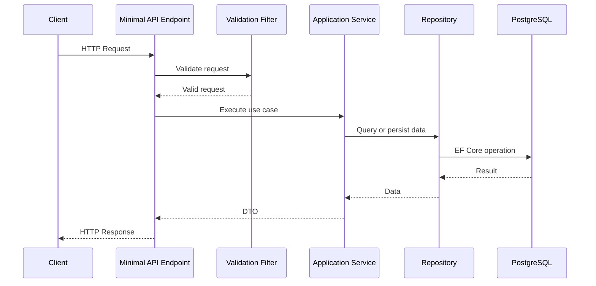
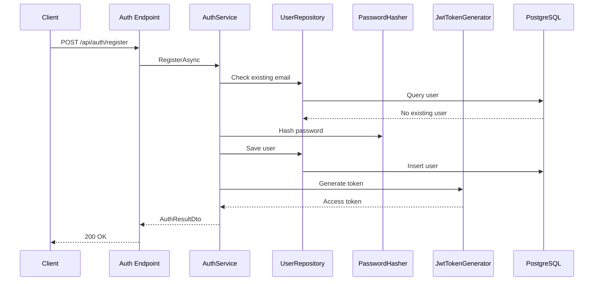
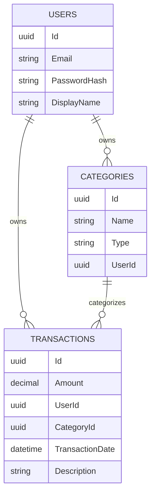

# Expense Tracker API

> Production-style REST API for personal finance management built with **ASP.NET 10, Clean Architecture, Entity Framework Core, PostgreSQL, JWT Authentication, FluentValidation**, Docker, and automated tests.

This backend is designed as a portfolio project demonstrating modern .NET backend engineering practices, including authentication, validation, persistence, testing, containerized development, and CI automation.

---

## Features

### Authentication & Authorization

- User Registration
- User Login
- JWT Bearer Authentication
- Secure Password Hashing
- Current user resolution
- Protected endpoints
- User data isolation

### Category Management

- Create Category
- Update Category
- Delete Category
- List user-specific categories
- Prevent duplicate category names per user

### Transaction Management

- Create Income Transactions
- Create Expense Transactions
- Update Transactions
- Delete Transactions
- List user-specific transactions
- Validate category ownership before creating or updating transactions

### Reporting

- Monthly financial summary
- Total income calculation
- Total expense calculation
- Monthly balance calculation

### Cross-Cutting Concerns

- FluentValidation request validation
- Reusable validation endpoint filter
- Global exception handling
- RFC7807 ProblemDetails responses
- Options Pattern for configuration
- Dependency Injection
- Repository Pattern
- Unit of Work

### Testing & Quality

- Unit tests for Application services
- Integration tests for API endpoints
- PostgreSQL Testcontainers
- GitHub Actions CI
- Code coverage collection
- HTML coverage report generation

---

## Technology Stack

### Runtime & Framework

- .NET 10
- ASP.NET Core Minimal APIs
- C#

### Database

- PostgreSQL
- Entity Framework Core
- EF Core Migrations

### Authentication

- JWT Bearer Authentication
- ASP.NET Core password hashing

### Validation

- FluentValidation
- Minimal API endpoint filters

### Testing

- xUnit
- FluentAssertions
- Moq
- Testcontainers
- Coverlet

### DevOps

- Docker
- Docker Compose
- GitHub Actions
- ReportGenerator

---

## Architecture

The backend follows **Clean Architecture** to keep business logic independent from infrastructure and presentation concerns.



### Layer Responsibilities

| **Layer** | **Responsibility** |
|-----------|--------------------|
| API       | Minimal API endpoints, request contracts, filters, authentication middleware  |
| Application   |	Business use cases, DTOs, service interfaces, repository abstractions   |
| Domain    |	Entities, enums, core business rules    |
| Infrastructure    |	EF Core DbContext, repositories, JWT generation, password hashing   |
| Tests |	Unit and integration tests  |

---

## Solution Structure

```text
backend
│
├── ExpenseTracker.Api
│
├── ExpenseTracker.Application
│
├── ExpenseTracker.Domain
│
├── ExpenseTracker.Infrastructure
│
├── ExpenseTracker.Tests
│
└── docker-compose.yml
```

---

## Request Flow



---

## Authentication Flow



---

## Database Schema



---

## Architecture Decisions

| Decision  | Reason    |
|-----------|-----------|
| Clean Architecture    | Keeps domain and application logic independent from infrastructure     |
| Minimal APIs    |	Lightweight and modern ASP.NET Core API style     |
| Repository Pattern    |	Encapsulates database access and improves testability     |
| Unit of Work    |	Centralizes transaction persistence through EF Core     |
| JWT Authentication    |	Stateless authentication for REST APIs     |
| CurrentUser abstraction    |	Keeps user resolution out of application services     |
| FluentValidation    |	Keeps validation logic outside endpoint handlers     |
| Global Exception Handler    |	Centralizes business exception to HTTP response mapping     |
| Testcontainers    |	Enables integration tests against a real PostgreSQL database     |
| Options Pattern    |	Strongly typed configuration for JWT settings     |

---

## Getting Started

### Prerequisites

Install:
- .NET 10 SDK
- Docker Desktop
- PostgreSQL client tool such as pgAdmin, DBeaver, or DataGrip
- Git

---

## Local Configuration

The API supports layered configuration.

The recommended local setup is:

``appsettings.json``
``appsettings.Development.json``
``appsettings.Development.Local.json``

``appsettings.Development.Local.json`` should contain machine-specific secrets and must not be committed to Git.

Example:

```json

{ 
    "Jwt": { 
        "SecretKey": "your-local-development-secret-key-with-at-least-32-characters" 
    }
}

```

Make sure `.gitignore` contains:

`appsettings.Development.Local.json`

---

## Docker & PostgreSQL

From the repository root:

```bash
docker compose up -d
```

This starts PostgreSQL for local development.

To stop the containers:

```bash
docker compose down
```

To stop the containers and remove the volumes:

```bash
docker compose down -v
```

Use `docker compose down -v` only when you want to completely reset the local database, as it deletes all PostgreSQL data stored in Docker volumes.

---

## Database Migrations

From the `backend` directory:

```bash
dotnet ef database update \ 
    --project src/ExpensesTracker.Infrastructure \ 
    --startup-project src/ExpensesTracker.Api
```

On Windows PowerShell:

```bash
dotnet ef database update ` 
    --project src/ExpensesTracker.Infrastructure ` 
    --startup-project src/ExpensesTracker.Api
```

To create a new migration:

```bash
dotnet ef migrations add MigrationName \ 
    --project src/ExpensesTracker.Infrastructure \ 
    --startup-project src/ExpensesTracker.Api \ 
    --output-dir Persistence/Migrations
```

---

## Running the API

From the `backend` directory:

`dotnet run --project src/ExpensesTracker.Api`

The API exposes OpenAPI documentation through Scalar.

Typical URL:

`https://localhost:<port>/scalar`

---

## API Endpoints

### Authentication

#### Register

```http
POST /api/auth/register
```

#### Login

```http
POST /api/auth/login
```

---

### Categories

#### Get Current User's Categories

```http
GET /api/categories
```

#### Get Category by ID

```http
GET /api/categories/{id}
```

#### Create Category

```http
POST /api/categories
```

#### Update Category

```http
PUT /api/categories/{id}
```

#### Delete Category

```http
DELETE /api/categories/{id}
```

---

### Transactions

#### Get Current User's Transactions

```http
GET /api/transactions
```

#### Get Transaction by ID

```http
GET /api/transactions/{id}
```

#### Create Transaction

```http
POST /api/transactions
```

Example:

```json
{
  "amount": 50.00,
  "type": "Expense",
  "categoryId": "guid",
  "description": "Groceries"
}
```

#### Update Transaction

```http
PUT /api/transactions/{id}
```

#### Delete Transaction

```http
DELETE /api/transactions/{id}
```

---

### Reports

#### Get Monthly Financial Summary

```http
GET /api/reports/monthly-summary?year=2026&month=6
```

Example Response:

```json
{
  "totalIncome": 5000,
  "totalExpenses": 2500,
  "balance": 2500
}
```

---

## Validation

Request validation is implemented with FluentValidation and a reusable Minimal API endpoint filter.

Invalid requests return `400 Bad Request` with validation details.

Example invalid request:

```json
{ 
    "name": "", 
    "type": 2 
}
```

Example response:

```json
{ 
    "errors": { 
        "Name": [ 
            "'Name' must not be empty." 
        ] 
    } 
}
```

---

## Error Handling

Business exceptions are mapped to HTTP responses using a global exception handler.

| Exception | HTTP Status   |
|-----------|---------------|
| `NotFoundException`   | 404 Not Found |
| `ConflictException`   |	409 Conflict    |
| `UnauthorizedException`   |	401 Unauthorized    |
| Unhandled Exception   |	500 Internal Server Error   |

Responses follow the RFC7807 ProblemDetails format.

---

## Testing

The backend contains both unit and integration tests.

Run all tests:

`dotnet test`

---

## Unit Tests

Unit tests are located in:

`ExpensesTracker.Application.Tests`

They cover:

- Authentication service
- Category service
- Transaction service
- Report service

Unit tests use:

- xUnit
- Moq
- FluentAssertions

---

## Integration Tests

Integration tests are located in:

`ExpensesTracker.Api.IntegrationTests`

They cover:

- Authentication endpoints
- Category endpoints
- Transaction endpoints
- Report endpoints

Integration tests run the API against a real PostgreSQL database using Testcontainers.

This validates:

- Routing
- Authentication
- Authorization
- Validation
- Exception handling
- EF Core persistence
- Database queries

---

## Code Coverage

Code coverage is collected in CI using Coverlet.

A readable HTML coverage report is generated with ReportGenerator and uploaded as a GitHub Actions artifact.

Local coverage command:

`dotnet test --collect:"XPlat Code Coverage"`

---

## CI/CD

GitHub Actions automatically runs on push and pull request.

The backend workflow performs:

- Restore
- Build
- Unit tests
- Integration tests
- Code coverage collection
- Coverage report generation
- Coverage artifact upload

Workflow file:

`.github/workflows/backend-ci.yml`

---

# Screenshots

## Scalar UI

_Add screenshot after implementation._

## Docker Deployment

_Add screenshot after implementation._

## GitHub Actions

_Add screenshot after implementation._


---

# Future Improvements

Planned backend improvements:

- Refresh tokens
- Role-based authorization
- Pagination
- Sorting
- Filtering
- Additional report endpoints
- Expense by category report
- Monthly trend report
- Budget planning
- OpenTelemetry
- Prometheus metrics
- Grafana dashboards
- Azure deployment
- Kubernetes manifests
- AI-powered spending insights

---

# Author

**Handyana Sumitra Atmaja**

Senior Software Engineer

Core Technologies:

- C#
- .NET
- ASP.NET Core
- Azure
- Docker
- Kubernetes
- PostgreSQL
- Angular
- Clean Architecture

LinkedIn:
https://www.linkedin.com/in/handyana-sumitra-atmaja

GitHub:
https://github.com/handyana05