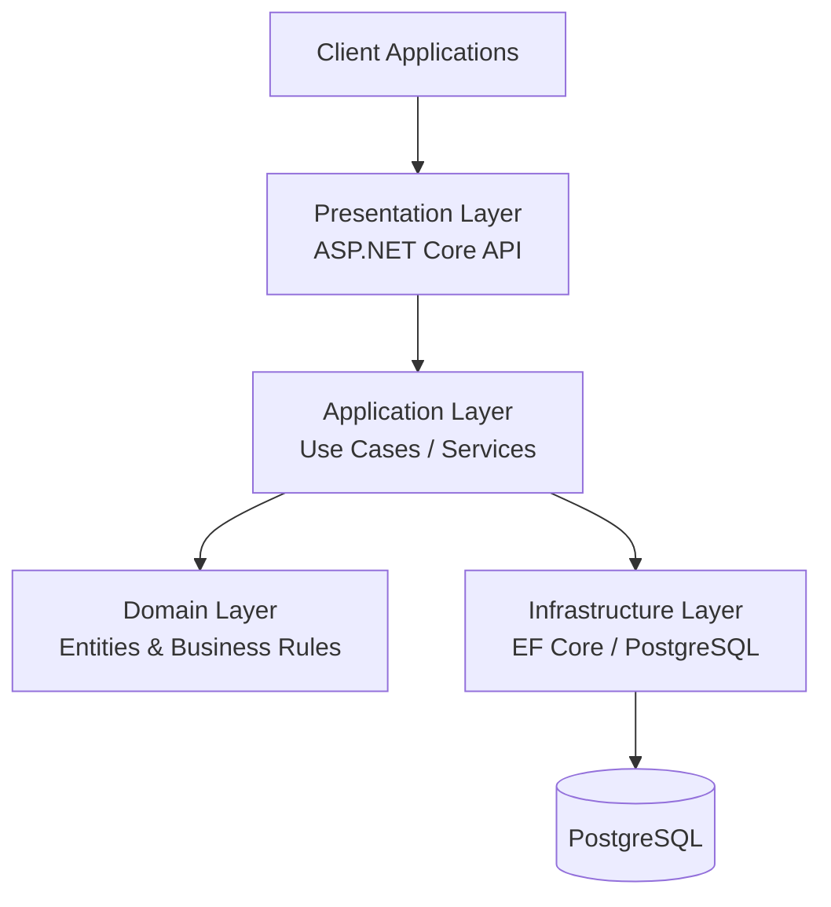
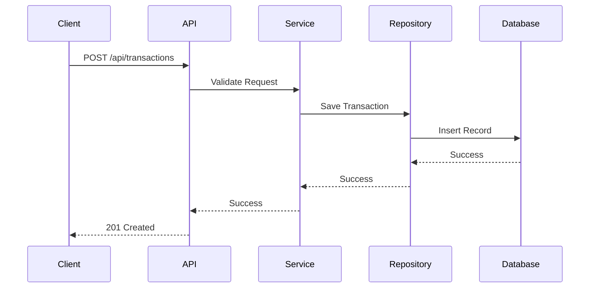
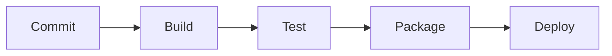

# Expense Tracker API

A production-ready REST API built with ASP.NET Core, Entity Framework Core, PostgreSQL, JWT Authentication, Docker, and Clean Architecture principles.

This project demonstrates enterprise-grade backend development practices including authentication, validation, testing, containerization, and CI/CD automation.

---

## Features

### Authentication & Authorization

- User Registration
- User Login
- JWT Bearer Authentication
- Secure Password Hashing
- Protected Endpoints

### Category Management

- Create Category
- Update Category
- Delete Category
- List Categories

### Transaction Management

- Create Income Transactions
- Create Expense Transactions
- Update Transactions
- Delete Transactions
- Filter Transactions

### Reporting

- Monthly Income Summary
- Monthly Expense Summary
- Balance Calculation
- Category-based Reports

### Technical Features

- Clean Architecture
- Repository Pattern
- Entity Framework Core
- PostgreSQL
- FluentValidation
- Swagger/OpenAPI
- Serilog Logging
- xUnit Unit Tests
- Docker Support
- GitHub Actions CI/CD

---

# Architecture

The application follows Clean Architecture principles to ensure maintainability, testability, and separation of concerns.



---

# Solution Structure

```text
backend
│
├── ExpenseTracker.Api
│
├── ExpenseTracker.Application
│
├── ExpenseTracker.Domain
│
├── ExpenseTracker.Infrastructure
│
├── ExpenseTracker.Tests
│
└── docker-compose.yml
```

---

# Technology Stack

## Backend

- ASP.NET Core 9
- C#
- Entity Framework Core

## Database

- PostgreSQL

## Authentication

- JWT Bearer Authentication

## Validation

- FluentValidation

## Logging

- Serilog

## Testing

- xUnit
- FluentAssertions

## Containerization

- Docker
- Docker Compose

## CI/CD

- GitHub Actions

---

# Domain Model

## User

```csharp
public class User
{
    public Guid Id { get; set; }

    public string Email { get; set; }

    public string PasswordHash { get; set; }
}
```

## Category

```csharp
public class Category
{
    public Guid Id { get; set; }

    public string Name { get; set; }
}
```

## Transaction

```csharp
public class Transaction
{
    public Guid Id { get; set; }

    public decimal Amount { get; set; }

    public TransactionType Type { get; set; }

    public Guid CategoryId { get; set; }

    public DateTime Date { get; set; }

    public string Description { get; set; }
}
```

---

# API Endpoints

## Authentication

### Register

```http
POST /api/auth/register
```

### Login

```http
POST /api/auth/login
```

---

## Categories

### Get Categories

```http
GET /api/categories
```

### Create Category

```http
POST /api/categories
```

### Update Category

```http
PUT /api/categories/{id}
```

### Delete Category

```http
DELETE /api/categories/{id}
```

---

## Transactions

### Get Transactions

```http
GET /api/transactions
```

### Create Transaction

```http
POST /api/transactions
```

Example:

```json
{
  "amount": 50.00,
  "type": "Expense",
  "categoryId": "guid",
  "description": "Groceries"
}
```

### Update Transaction

```http
PUT /api/transactions/{id}
```

### Delete Transaction

```http
DELETE /api/transactions/{id}
```

---

## Reports

### Monthly Report

```http
GET /api/reports/monthly
```

Example Response:

```json
{
  "income": 5000,
  "expenses": 2500,
  "balance": 2500
}
```

---

# Request Flow



---

# Database Schema

```mermaid
erDiagram

    USERS {
        uuid Id
        string Email
        string PasswordHash
    }

    CATEGORIES {
        uuid Id
        string Name
    }

    TRANSACTIONS {
        uuid Id
        decimal Amount
        string Type
        uuid CategoryId
        datetime Date
        string Description
    }

    USERS ||--o{ TRANSACTIONS : owns

    CATEGORIES ||--o{ TRANSACTIONS : categorizes
}
```

---

# Running Locally

## Clone Repository

```bash
git clone https://github.com/yourname/expense-tracker-api.git
```

## Start Database

```bash
docker compose up -d postgres
```

## Apply Migrations

```bash
dotnet ef database update
```

## Run API

```bash
dotnet run --project src/ExpenseTracker.Api
```

---

# Docker

Build:

```bash
docker build -t expense-tracker-api .
```

Run:

```bash
docker run -p 8080:8080 expense-tracker-api
```

---

# Testing

Run Unit Tests

```bash
dotnet test
```

---

# CI/CD

GitHub Actions automatically:

- Restore dependencies
- Build solution
- Run unit tests
- Generate artifacts



---

# Future Improvements

- Refresh Tokens
- Role-Based Authorization
- OpenTelemetry
- Prometheus Metrics
- Grafana Dashboards
- RabbitMQ Event Publishing
- Expense Import/Export
- Budget Planning
- Email Notifications
- Azure Deployment

---

# Screenshots

## Swagger UI

_Add screenshot after implementation._

## Docker Deployment

_Add screenshot after implementation._

## GitHub Actions

_Add screenshot after implementation._

---

# Author

**Handyana Sumitra Atmaja**

Senior Software Engineer

Technologies:
ASP.NET Core • C# • Azure • Docker • Kubernetes • PostgreSQL • Entity Framework Core • Clean Architecture